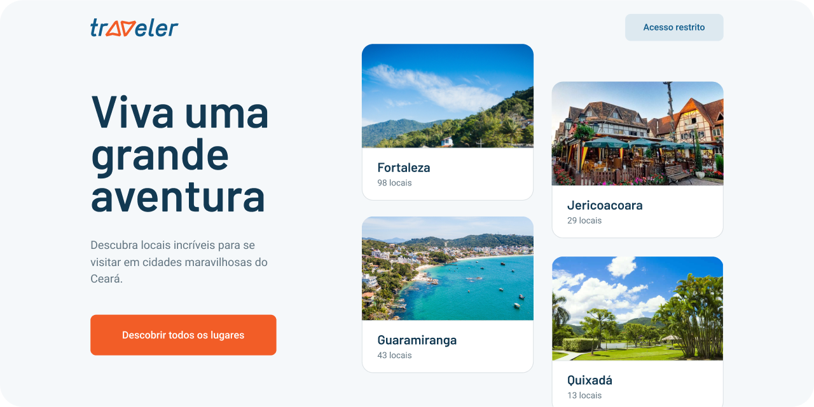

<h1 align="center">
	
</h1>

<h3 align="center">Traveler is great way for those who want to visit Ceará</h3>

  

  

  

## Hello! I made some changes, and there is no code here.

To make this project more organized, I moved the applications (rest api, web client) to 2 different repositories.

Here are the links to them:

- [Rest API](https://github.com/AlexsandroBezerra/traveler-api)
- [Web client](https://github.com/AlexsandroBezerra/traveler-web)

## 📝 License

This project is licensed under the MIT License - see the [LICENSE](LICENSE) file for details.

---
Made with :purple_heart: by Alexsandro G Bezerra 👋 &nbsp;[See my LinkedIn](https://www.linkedin.com/in/alexsandrobezerra)
